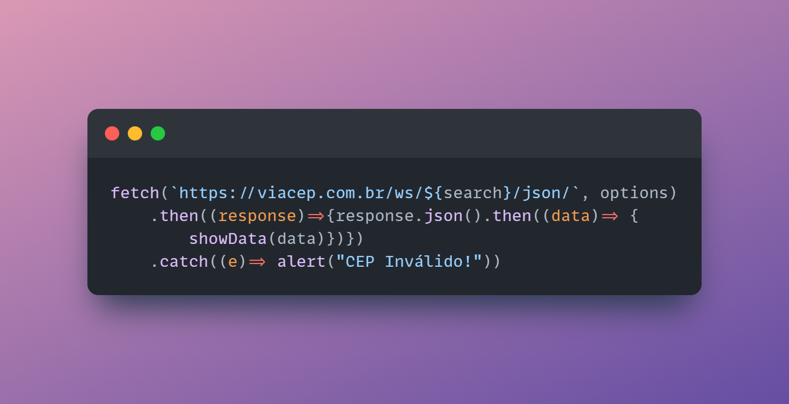
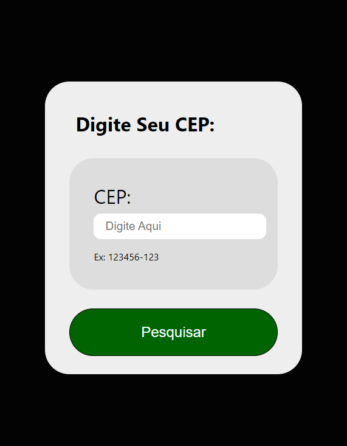
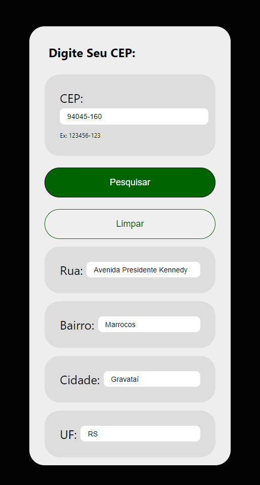

# Consulta-cep
--- 

---

## A simple application that uses JS to consume an API 

### Technologies Used:

- **HTML **
- **CSS **
- **JS **

### How does it work?
Using the property [Fetch](https://developer.mozilla.org/pt-BR/docs/Web/API/Fetch_API) from javascript to consume [ViaCep API](https://viacep.com.br/), and, only with a Brazillian Zipcode, it returns:

- Street name
- District name
- City name 
- State name

--- 
## The Application itself:

#### At first, the user has 2 options:

- when it opens the app, to type a **zipcode** and then **search** for it. 

- if it tries to search a **blank zipcode**, the application returns an alert sayin "CEP Inválido"(invalid Zipcode!)

#### When the user clicks on "Pesquisar"(Search) the app then returns:

